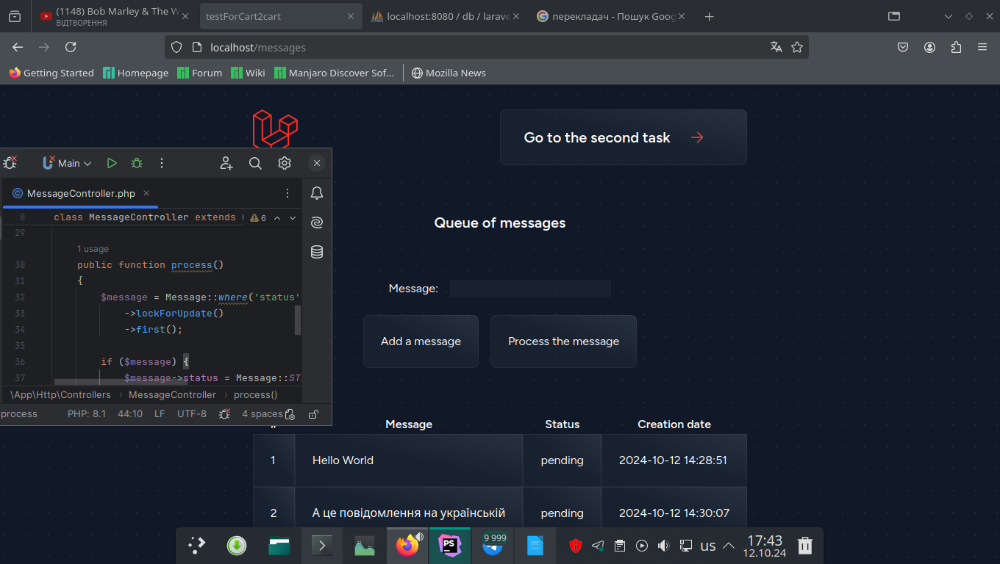
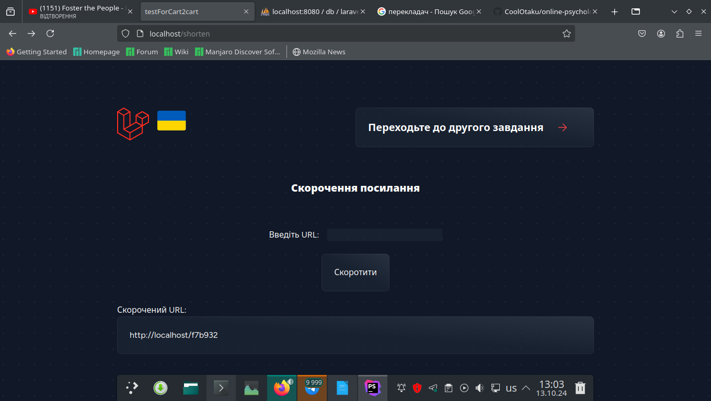
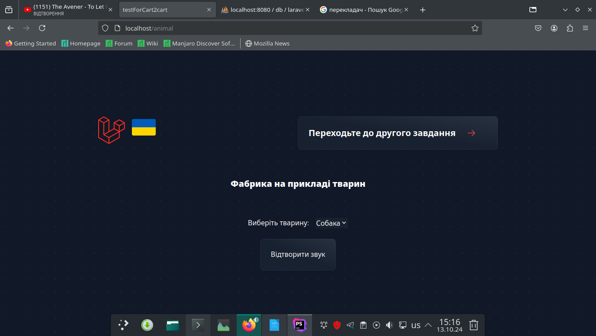

<p align="center"></p>
<h1 align="center">testForCart2cart</h1>

## Description
<b>EN:</b>

This website is created as a test task for **PHP Developer (Laravel)**.

Here I developed the site and **API** with different technologies.

The task sounded like this:

1. Task №1
You need to download the products and their prices from the online store. With what will you do it and what are the main nuances that need to be taken into account?

2. Task №2
Implement a message queue using **MySQL** for data storage. How to avoid the situation when several workers receive the same message for processing?

3. Task №3
Write a custom *artisan* command that will output the current time to the console.

4. Task №4
How would you implement a (*URL shortener*)? For example: [https://www.shorturl.at/](https://www.shorturl.at/). Implement the functionality of *url* shortening and saving data (file, database).

5. Task №5
Write a simple factory in php. What is the difference between a factory on ***php*** and on ***js***?

6. Task №6
**Cart2cart** transfers data between various platforms (80+ platforms), meaning basically from any platform to any other if possible.
How exactly do you think data should be transferred between so many platforms? What nuances need to be taken into account?

7. Task №7
You need to optimize the operation of the service. How is it possible to do this if you are not able to make changes to the code?

8. Task №8
***PhpUnit*** or other tests?

<b>Also more TK:</b>

Given:

1. *WizardStatsController.php* file - the controller used for the report
    - *route - admin/reports/wizard-stats*
2. *db.sql* file - a *mysqldump* of the database tables in use with some data

It is necessary: ​​on the basis of a clean **Laravel** project, create an **API** controller, and transfer the functionality
with *WizardStatsController* so that the logic was preserved and the controller was fully operational within the **Laravel** project.
The methods of the new controller **API** should output the same data as the *WizardStatsController* methods, however, in **JSON** format.

<b>UA:</b>

Це веб сайт створений як тестове завдання для **PHP Developer (Laravel)**.

Тут я розробив сайт та **API** з різними технологіями.

Завдання звучало так:

1. Задача №1
Вам потрібно спарсити продукти та їхні ціни з інтернет-магазину. За допомогою чого будете це робити і які основні нюанси потрібно врахувати?

2. Задача №2
Реалізуйте чергу повідомлень, використовуючи **MySQL** для зберігання даних. Як уникнути ситуації, коли декілька воркерів отримають в обробку однакове повідомлення?

3. Задача №3
Напишіть кастомну *artisan*-команду, яка в консоль буде виводити поточний час.

4. Задача №4
Як би ви реалізували скорочувалку (*URL Shortener*) урлів? Наприклад: [https://www.shorturl.at/](https://www.shorturl.at/). Реалізуйте функціонал скорочення *url* і збереження даних (файл, база).

5. Задача №5
Напишіть просту фабрику на php. Чим відрізняється фабрика на ***php*** і на ***js***?

6. Задача №6
**Cart2cart** переносить дані між різноманітними платформами (80+ платформ), тобто, по суті, з будь якої платформи на будь яку іншу, якщо це можливо.
Як саме, на вашу думку, має відбуватись перенесення даних між такою кількістю платформ? Які нюанси потрібно врахувати?

7. Задача №7
Вам потрібно оптимізувати роботу роботу сервісу. Яким чином можливо це зробити, якщо у вас немає можливості вносити зміни в код?

8. Задача №8
***PhpUnit*** чи інші тести?

<b>Також ще ТЗ:</b>

Дано:

1. файл *WizardStatsController.php* - контроллер що використовується для репорту
    - *route - admin/reports/wizard-stats*
2. файл *db.sql* - *mysqldump* таблиць бази даних, що використовуються, з деякими даними

Потрібно: на основі чистого проекту **Laravel**, створити **API** контроллер, та перенести функціонал
з *WizardStatsController* таким чином щоб логіка була збережена і контроллер був повністю робочим в межах проекту **Laravel**.
Методи нового **API** контроллера повинні видавати ті ж дані, що і методи *WizardStatsController*, проте, в **JSON** форматі.

#
## Screenshots
<p align="center">
  
  
  
  
  
  
  
  
</p>

#
## Technologies used
<b>EN:</b>
- Creating an application using the framework [**Laravel**](https://laravel.com/)
- Using [**Vite**](https://vite.dev/) for frontend generation
- Using [**Docker**](https://www.docker.com/) and *docker-compose*
- Using the database [**MariaDB**](https://mariadb.org/)
- Using [**phpMyAdmin**](https://www.phpmyadmin.net/) for database administration
- Using the ***MVC*** programming model
- Use of various technologies described in the assignment
- Creating your own **API**

<b>UA:</b>
- Створення застосунку за допомогою фреймворку [**Laravel**](https://laravel.com/)
- Використання [**Vite**](https://vite.dev/) для генерації фронтенду
- Використання [**Docker**](https://www.docker.com/) та *docker-compose*
- Використання бази даних [**MariaDB**](https://mariadb.org/)
- Використання [**phpMyAdmin**](https://www.phpmyadmin.net/) для адміністрування бази даних
- Використання моделі програмування ***MVC***
- Використання різних технологій описаних в завданні
- Створення власного **API**

#
## License
```
© 2024, CoolOtaku (ericspz531@gmail.com)
```
