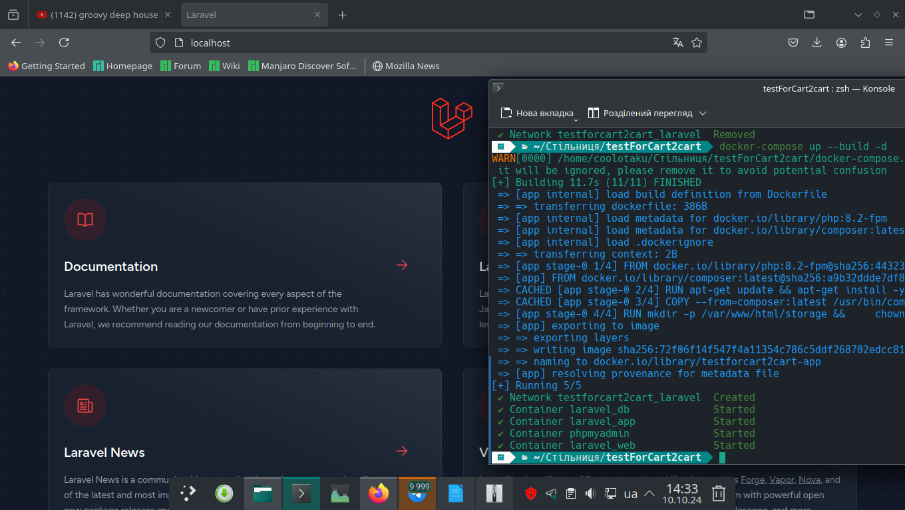
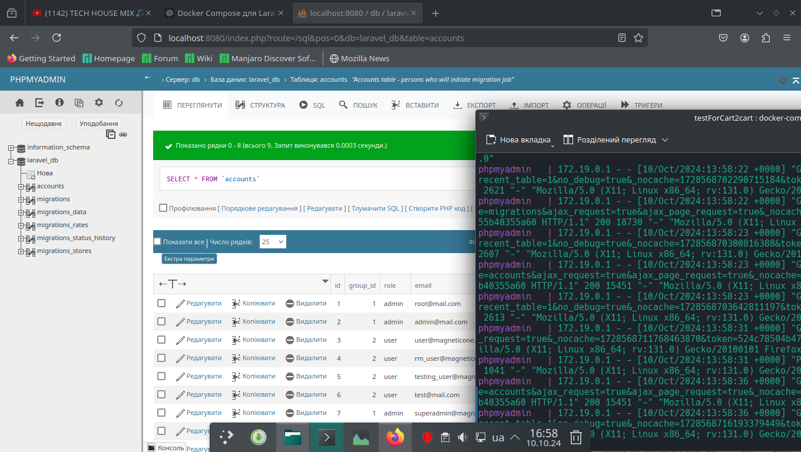
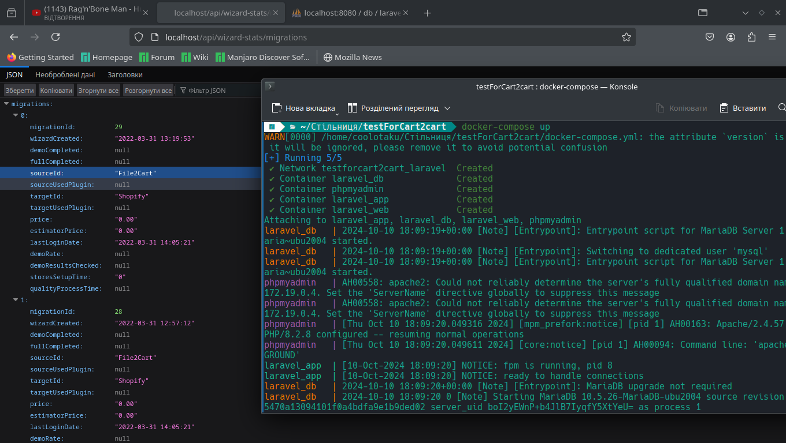
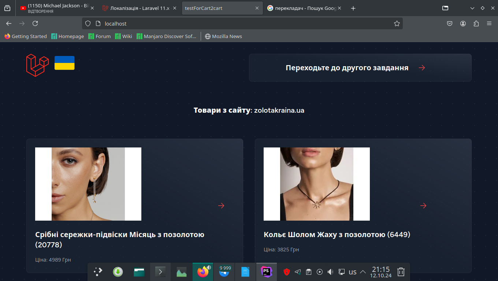
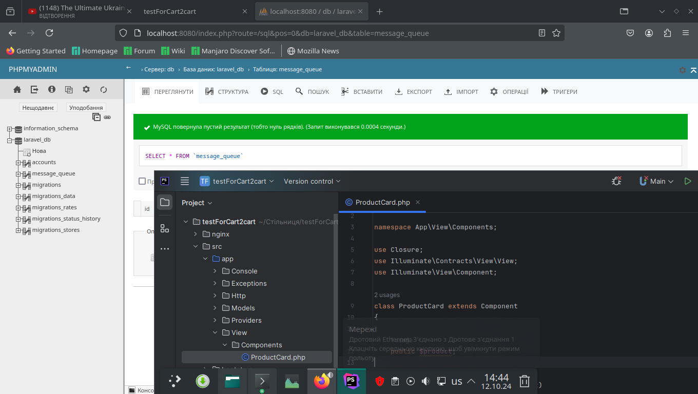

<p align="center"></p>
<h1 align="center">testForCart2cart</h1>

## Description
<b>EN:</b>

This website was created as a test task for one of the positions ***PHP Moodle Developer***.

Here I developed a *block* plugin called "*User List Block*".

This plugin visualizes a user interface element that shows a list of all users and their rating.

[*listusers*](https://github.com/CoolOtaku/testMoodle/tree/main/moodle/blocks/listusers) plugin directory.

The task sounded like this:

1. Task №1
Implement a Block type plugin for the Moodle system with the following functionality:

- Display a table with a list of all users in the block.

3. Task №2
Add to the block the ability to select one user and rate him from 1 to 10 points. Save the entered rating in the table that should be created when installing this plugin. Display this estimate in a table with users.

4. Task №3
Try using the MVS model in your plugin using the php files provided with the task.

<b>UA:</b>

Це веб сайт створений як тестове завдання на одну з позицій ***PHP Moodle Developer***.

Тут я розробив плагін пибу *block* під назваю "*User List Block*".

Даний плагін візуалізує, елемент користувацького інтерфейсу який показує переліком всіх користувачів та їх оцінку.

Директорія плагіну [*listusers*](https://github.com/CoolOtaku/testMoodle/tree/main/moodle/blocks/listusers).

Завдання звучало так:

1. Задача №1
Реалізувати плігін типу Блок для системи Moodle з наступним функціоналом:

- Вивести в блоці таблицю з переліком всіх користувачів.
   
3. Задача №2
Додати в блок можливість вибрати одного користувача і виставити йому оцінку від 1 до 10 балів. Зберегти внесену оцінку в таблиці, що має створюватися при інсталяції цього плагіну. Вивести цю оцінку в таблиці з користувачами.

4. Задача №3
Спробуйте використати модель MVС в своему плагіні, використовуючи надані з завданням php-файли.

#
## Screenshots
<p align="center">
  
  
  
  
  
</p>

#
## Technologies used
<b>EN:</b>
- Creating an application using the framework [**Moodle**](https://moodle.org/)
- Using [**Docker**](https://www.docker.com/) and *docker compose*
- Using the database [**MariaDB**](https://mariadb.org/)
- Using [**phpMyAdmin**](https://www.phpmyadmin.net/) for database administration
- Using the ***MVC*** programming model
- Creating a plugin of the *block* type

<b>UA:</b>
- Створення застосунку за допомогою фреймворку [**Moodle**](https://moodle.org/)
- Використання [**Docker**](https://www.docker.com/) та *docker compose*
- Використання бази даних [**MariaDB**](https://mariadb.org/)
- Використання [**phpMyAdmin**](https://www.phpmyadmin.net/) для адміністрування бази даних
- Використання моделі програмування ***MVC***
- Створення плагіну типу *block*

#
## License
```
© 2024, CoolOtaku (ericspz531@gmail.com)
```


Дано:
1. файл WizardStatsController.php - контроллер що використовується для репорту
    - route - admin/reports/wizard-stats
2. файл db.sql - mysqldump таблиць бази даних, що використовуються, з деякими даними

Потрібно: на основі чистого проекту Laravel, створити API контроллер, та перенести функціонал
з WizardStatsController таким чином щоб логіка була збережена і контроллер був повністю робочим в межах проекту Laravel.
Методи нового API контроллера повинні видавати ті ж дані, що і методи WizardStatsController, проте, в JSON форматі.
